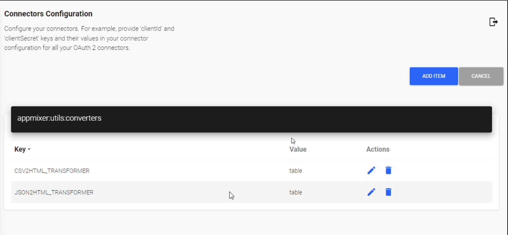

JSON2HTML, CSV2HTML
You can define a custom HTML transformer by creating a new instance of the Transform class in htmlTransforms.js.
htmlTransforms:

```js
const { Transform } = require('stream');

module.exports = {

      myHtmlTransform: {
          jsonPath: '*', // https://www.npmjs.com/package/JSONStream#jsonstreamparsepath
          transform: () => {
              return new Transform({
                  writableObjectMode: true,
                  readableObjectMode: false,
                  transform(chunk, encoding, callback) {
                      // implementation of your custom transformation
                      callback();
                  },
                  final(callback) {
                      callback( );
                  }
              });
          }
      }
};
```
configure the transformer type in the Backoffice:
`JSON2HTML_TRANSFORMER`, `CSV2HTML_TRANSFORMER`

By default both `JSON2HTML_TRANSFORMER` and `CSV2HTML_TRANSFORMER` are set to type `table`

